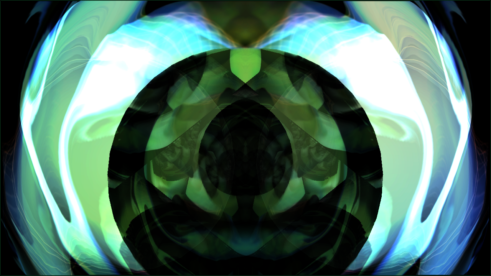
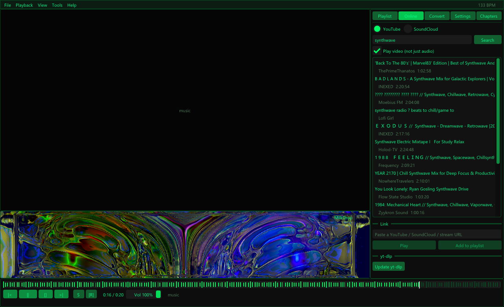
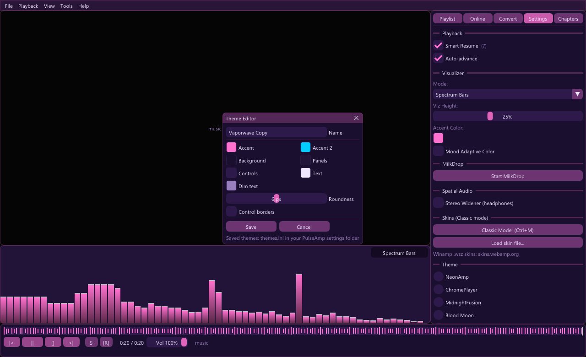
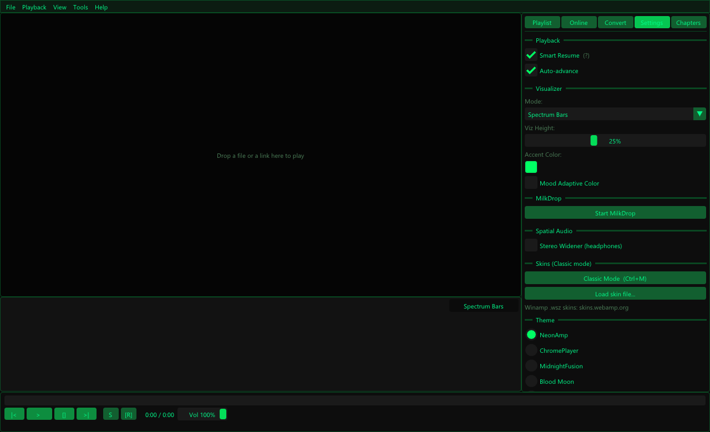
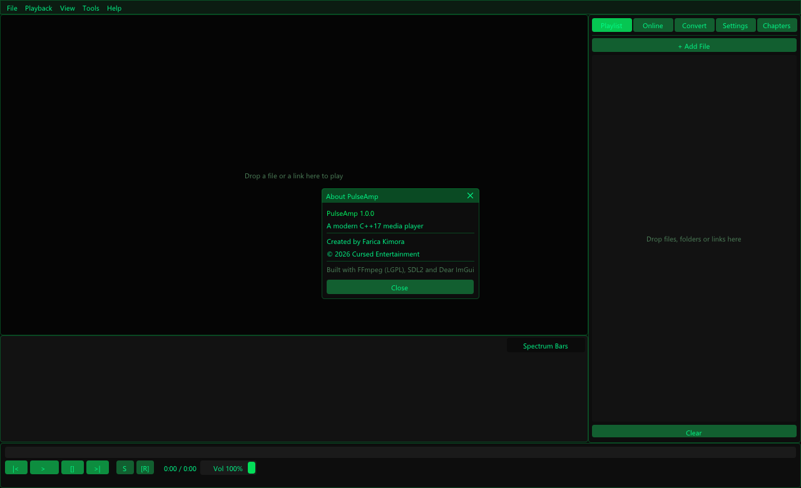
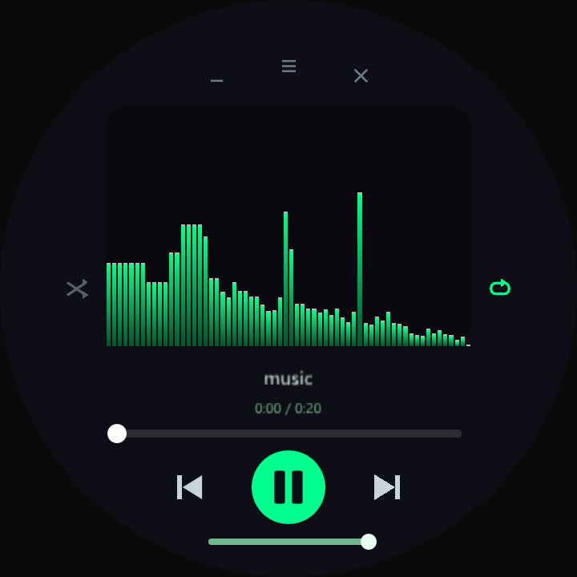
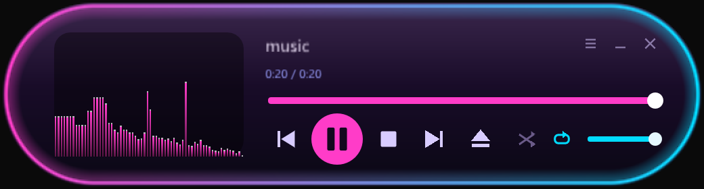

[](https://x.com/NorowaretaGemu)
[](https://opensource.org/licenses/MIT)

<div align="center">
  <a href="https://ko-fi.com/cursedentertainment">
    
  </a>
</div>


# PulseAmp (media_player)

A modern C++17 media player built on FFmpeg, SDL2, OpenGL and Dear ImGui: video and audio playback, YouTube and SoundCloud, MilkDrop visualizations, Winamp skins, real-time BPM detection, a waveform seek bar, smart resume, a stereo widener and a built-in format converter.

## Download

**[cursedprograms.github.io/PulseAmp-Media-Player](https://cursedprograms.github.io/PulseAmp-Media-Player/)**

- **Windows 10/11 (64-bit):** installer, portable zip and MilkDrop presets. The files are also in [`dist/`](dist/).
- **Linux (x86-64):** [PulseAmp-x86_64.AppImage](https://github.com/CursedPrograms/PulseAmp-Media-Player/releases/download/continuous/PulseAmp-x86_64.AppImage), built automatically from `main` with everything included. Run `chmod +x PulseAmp-x86_64.AppImage` and start it. Needs a 2024-or-newer distro (Ubuntu 24.04, Fedora 40, Debian 13, Arch...); file dialogs use `zenity`.

## Screenshots



| YouTube search + MilkDrop | Vaporwave theme + theme editor |
|---|---|
|  |  |
| **Settings panel** | **About window** |
|  |  |

**Classic mode skins:** PulseOrb (round) and NeonCapsule (shaped from its PNG)

<p align="center">
  
  &nbsp;
  
</p>

## Highlights

- **YouTube & SoundCloud:** search and play from the **Online** tab, paste a link, or drag one in from your browser. Uses [yt-dlp](https://github.com/yt-dlp/yt-dlp) (bundled with the Windows build; "Update yt-dlp" in the Online tab keeps it working). YouTube plays with video up to 1080p, or audio only.
- **MilkDrop visualizer:** the classic Winamp visualizer through [projectM](https://github.com/projectM-visualizer/projectm), with the 9,795-preset "Cream of the Crop" pack. Switch presets with `[` / `]`.
- **Classic mode & skins:** `Ctrl+M` turns PulseAmp into a compact window in the shape of its skin. Load real **Winamp 2.x `.wsz` skins** (thousands at [skins.webamp.org](https://skins.webamp.org/)) or PulseAmp skins you can design yourself. See [skins/README.md](skins/README.md).
- **Themes:** 8 built-in colour themes plus a live **Theme Editor** to make and save your own.
- **Scales with the window:** text and controls grow and shrink with the window and adapt to high-DPI screens. **Double-click** the video or visualizer for fullscreen; the controls hide after a few seconds.

## Build Instructions

## What You Need

| Dependency | Version | Notes |
|---|---|---|
| CMake | ≥ 3.20 | [cmake.org](https://cmake.org) |
| C++ compiler | C++17 | GCC 10+, Clang 12+, MSVC 2022 |
| FFmpeg dev libs | 6.x – 8.x | avformat, avcodec, avutil, swscale, swresample |
| SDL2 dev libs | ≥ 2.26 | [libsdl.org](https://libsdl.org) |
| OpenGL | 3.3+ | Provided by your GPU driver |
| ImGui, miniz | v1.90, 3.1 | **Auto-downloaded** by CMake FetchContent |
| projectM (+ GLEW on Windows) | 4.1 | Optional (MilkDrop). Uses an installed projectM 4 if found, otherwise **auto-downloaded and built** |
| yt-dlp | latest | Runtime only, for YouTube / SoundCloud: next to the exe or on `PATH` |

---

## Linux (Ubuntu / Debian)

### 1. Install dependencies
```bash
sudo apt update
sudo apt install -y \
    build-essential cmake git \
    libavformat-dev libavcodec-dev libavutil-dev \
    libswscale-dev libswresample-dev \
    libsdl2-dev libgl1-mesa-dev libglu1-mesa-dev \
    libx11-dev libxext-dev \
    zenity           # optional: file-open dialog
```

### 2. Clone & build
```bash
git clone https://github.com/CursedPrograms/media_player.git
cd media_player
cmake -B build -DCMAKE_BUILD_TYPE=Release
cmake --build build -j$(nproc)
```

### 3. Run
```bash
./build/PulseAmp /path/to/movie.mkv
```

---

## Windows (Visual Studio 2022 + vcpkg)

### 1. Install vcpkg
```powershell
git clone https://github.com/microsoft/vcpkg C:\vcpkg
C:\vcpkg\bootstrap-vcpkg.bat
C:\vcpkg\vcpkg integrate install
```

### 2. Install dependencies via vcpkg
```powershell
C:\vcpkg\vcpkg install ffmpeg[avcodec,avformat,avutil,swscale,swresample]:x64-windows
C:\vcpkg\vcpkg install sdl2:x64-windows
```

### 3. Configure & build
```powershell
git clone https://github.com/CursedPrograms/media_player.git
cd media_player
cmake -B build `
  -DCMAKE_BUILD_TYPE=Release `
  -DCMAKE_TOOLCHAIN_FILE=C:\vcpkg\scripts\buildsystems\vcpkg.cmake `
  -DPULSEAMP_BUNDLE_FFMPEG=ON `
  -DFFMPEG_BIN_DIR="C:\vcpkg\installed\x64-windows\bin"
cmake --build build --config Release
```

### 4. Run
```
build\Release\PulseAmp.exe C:\Videos\movie.mp4
```

### 5. Package (portable zip + optional installer)
```powershell
# Collects the exe, DLLs, yt-dlp, MilkDrop presets/textures and skins into dist\PulseAmp
.\scripts\package-windows.ps1 -BuildDir build\Release -FFmpegBin C:\vcpkg\installed\x64-windows\bin
# Add -Installer to also build dist\PulseAmp-Setup.exe (needs NSIS: https://nsis.sourceforge.io/)
# Output (each under GitHub's 100 MB file limit): PulseAmp-win64.zip, PulseAmp-milkdrop-presets.zip, PulseAmp-Setup.exe
```

---

## macOS (Homebrew)

### 1. Install dependencies
```bash
brew install cmake ffmpeg sdl2
```

### 2. Build
```bash
cmake -B build -DCMAKE_BUILD_TYPE=Release
cmake --build build -j$(sysctl -n hw.logicalcpu)
```

### 3. Run
```bash
./build/PulseAmp ~/Movies/movie.mp4
```

---

## MinGW-w64 on Windows (alternative to MSVC)

```bash
# Install MSYS2, then in MSYS2 MinGW64 shell:
pacman -S mingw-w64-x86_64-cmake mingw-w64-x86_64-gcc \
          mingw-w64-x86_64-ffmpeg mingw-w64-x86_64-SDL2

cmake -B build -G "MinGW Makefiles" -DCMAKE_BUILD_TYPE=Release
cmake --build build -j4
```

MinGW builds link the GCC runtime statically, so `PulseAmp.exe` only needs `SDL2.dll` and the FFmpeg DLLs next to it (add `-DPULSEAMP_BUNDLE_FFMPEG=ON -DFFMPEG_BIN_DIR=<ffmpeg bin folder>` to copy them automatically).

---

## CMake Options

| Option | Default | Description |
|---|---|---|
| `PULSEAMP_BUNDLE_FFMPEG` | `OFF` | Copy the FFmpeg and SDL2 DLLs next to the exe (Windows) |
| `FFMPEG_BIN_DIR` | *(empty)* | Path to FFmpeg bin/ containing .dll files |
| `PULSEAMP_WITH_PROJECTM` | `ON` | MilkDrop visualizer (projectM) |
| `PULSEAMP_FETCH_PROJECTM` | `ON` | Download and build projectM if it isn't installed |
| `CMAKE_BUILD_TYPE` | — | `Release` for optimized build, `Debug` for dev |

---

## Project Structure

```
media_player/
├── CMakeLists.txt          ← Build system
├── README.md               ← This file
├── cmake/projectm.cmake    ← projectM (+ GLEW) build integration
├── src/
│   ├── main.cpp            ← Entry point, SDL2+GL window, UI scaling, main loop
│   ├── player.{h,cpp}      ← FFmpeg decode pipeline (1-2 inputs, demux + audio/video threads)
│   ├── audio_output.{h,cpp}← SDL2 audio device (volume, pause, stereo widener)
│   ├── video_renderer.{h,cpp}← OpenGL RGBA texture upload
│   ├── visualizer.{h,cpp}  ← 5 built-in visualizer modes with FFT
│   ├── milkdrop.{h,cpp}    ← MilkDrop via projectM
│   ├── online.{h,cpp}      ← YouTube / SoundCloud via yt-dlp
│   ├── skin.{h,cpp}        ← Winamp .wsz + PulseAmp skin loading
│   ├── skin_window.{h,cpp} ← Shaped windows
│   ├── ui_skin.cpp         ← Classic mode (skinned window)
│   ├── theme_manager.{h,cpp}← Colour themes + theme editor storage
│   ├── fonts.{h,cpp}       ← Font atlas (symbols, CJK on demand)
│   ├── ui_manager.{h,cpp}  ← Full ImGui interface
│   ├── converter.{h,cpp}   ← FFmpeg format converter
│   ├── playlist.{h,cpp}    ← Playlist + smart resume
│   ├── bpm_detector.{h,cpp}← Real-time BPM detection
│   ├── spatial_audio.{h,cpp}← Stereo widener
│   ├── waveform.{h,cpp}    ← Async full-file waveform generator
│   ├── json.{h,cpp}, paths.{h,cpp}, screenshot.{h,cpp}
├── skins/                  ← Bundled skins + skin format docs
├── scripts/package-windows.ps1 ← Portable zip / installer packaging
└── installer/
    └── setup.nsi           ← NSIS Windows installer script
```

---

## Supported Formats

| Container | Extensions |
|---|---|
| Video | `.mkv` `.mp4` `.avi` `.mov` `.webm` |
| Audio | `.mp3` `.flac` `.wav` `.ogg` `.aac` `.opus` `.m4a` |

Codec support depends on your installed FFmpeg build.  
The bundled FFmpeg from vcpkg/apt/brew covers H.264, H.265/HEVC, VP8, VP9, AV1, MP3, AAC, Vorbis, FLAC, and more.

---

## Keyboard Shortcuts

| Key | Action |
|---|---|
| `Space` | Play / Pause |
| `←` / `→` | Seek ±5 seconds |
| `↑` / `↓` | Volume ±5% |
| `M` | Toggle mute |
| `N` / `P` | Next / Previous track |
| `O` | Open file |
| `Tab` | Toggle sidebar |
| `V` | Toggle visualizer |
| `F` / double-click | Toggle fullscreen |
| `Ctrl+M` | Classic mode (skins) |
| `[` / `]` | Previous / next MilkDrop preset |
| `Esc` | Leave fullscreen / classic mode, otherwise quit |

---

## Themes

| Theme | Palette | Inspired by |
|---|---|---|
| **NeonAmp** | Black + Electric Green | Winamp 2.x |
| **ChromePlayer** | Silver-Grey + Steel Blue | Windows Media Player 9 |
| **MidnightFusion** | Deep Purple + Molten Gold | PulseAmp original |
| **Blood Moon** | Near-black + Crimson | PulseAmp original |
| **Vaporwave** | Violet + Pink / Cyan | PulseAmp original |
| **Arctic** | Deep Teal + Ice Blue | PulseAmp original |
| **Amber Terminal** | Black + Amber | Retro terminals |
| **Classic Silver** | Light Grey + Navy (light theme) | Classic Windows |

Make your own with **View → Theme → Theme Editor**; custom themes are saved to `themes.ini` in your settings folder.

---

## Visualizer Modes

| Mode | Description | Unique |
|---|---|---|
| Spectrum Bars | Classic FFT bar graph with peak hold | — |
| Oscilloscope | Real-time waveform trace | — |
| **Radial Spectrum** | Rotating circular FFT ring | ✅ PulseAmp exclusive |
| **BPM Pulse** | Beat-reactive expanding rings + spectrum border | ✅ PulseAmp exclusive |
| **Particle Storm** | Frequency-driven particle field | ✅ PulseAmp exclusive |
| **MilkDrop** | Winamp's MilkDrop through projectM, thousands of presets | — |

---

## Unique Features (not in other players)

1. **BPM Detection** — Real-time energy-based beat tracking; BPM shown in menu bar  
   and used to drive visualizer timing.

2. **Waveform Scrubber** — The seek bar displays the full-file RMS waveform  
   generated asynchronously on file open.  Seek by clicking anywhere on the waveform.

3. **Smart Resume** — Every file's playback position is saved to  
   `~/.pulseamp/resume.dat` (Linux/macOS) or `%APPDATA%\PulseAmp\resume.dat` (Windows).  
   Next time you open the same file, it picks up exactly where you left off.

4. **Mood-Adaptive Color** — Optional mode that analyzes the live frequency balance  
   (bass/mid/treble ratio) and continuously shifts the visualizer accent color  
   to reflect the "mood" of the music.

5. **Spatial Audio / Stereo Widener** — Haas-effect cross-feed filter that expands  
   the stereo field for headphone listening.  Width is adjustable from 0× (mono) to 2× (extreme).

6. **Radial Spectrum + BPM Pulse + Particle Storm visualizers** —  
   Three completely original visualization modes found nowhere else.

---

## Troubleshooting

**"FFmpeg not found"** → Make sure the dev libraries are installed and CMake can find them:  
use the vcpkg toolchain file, or pass `-DCMAKE_PREFIX_PATH=<ffmpeg folder containing include/ and lib/>`.

**No audio on Linux** → Install `libasound2-dev` (ALSA) or `libpulse-dev` (PulseAudio)  
and rebuild SDL2 with audio support.

**Black video / no video decode** → Your FFmpeg build may lack the codec.  
Use a full build: `ffmpeg -version` should list H.264 and H.265 decoders.

**ImGui font warnings** → The app falls back to the built-in pixel font automatically;  
this is harmless.

---

## Credits

**PulseAmp** was created by **Farica Kimora**.  
© 2026 Cursed Entertainment

Built with [FFmpeg](https://ffmpeg.org) (LGPL), [SDL2](https://libsdl.org), [Dear ImGui](https://github.com/ocornut/imgui), [projectM](https://github.com/projectM-visualizer/projectm) (LGPL), [GLEW](https://github.com/nigels-com/glew), [miniz](https://github.com/richgel999/miniz) and [yt-dlp](https://github.com/yt-dlp/yt-dlp). MilkDrop presets: "Cream of the Crop" collection curated by ISOSCELES.

YouTube and SoundCloud playback goes through yt-dlp; their terms of service don't allow third-party players, so treat it as a personal-use feature.

### Developer options

`PulseAmp --screenshot out.png [--size 1280x780] [--frames 30] [--show about|themes|settings|online|milkdrop|fullscreen|skin:<path>|search:<query>]` renders the UI offscreen and saves a PNG. Set `PULSEAMP_DATA_DIR` to use a separate settings folder.

---

<div align="center">© Cursed Entertainment 2026</div>
<br>
<div align="center">
  <a href="https://cursed-entertainment.itch.io/" target="_blank">
    
  </a>
</div>
